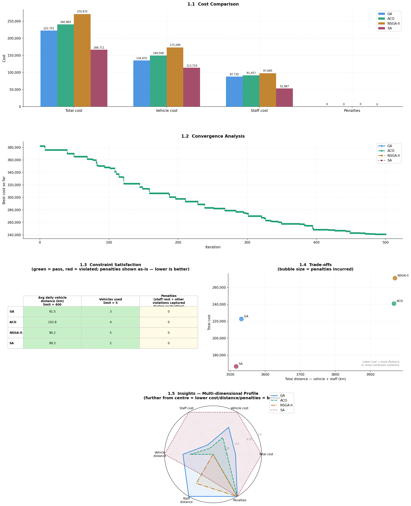

# evolutionary-algorithms

A multi-algorithm optimization framework for logistics scheduling in disaster response scenarios. The core problem involves delivering medical supplies to affected locations while ensuring healthcare specialists only visit after supplies have arrived — subject to constraints on vehicle scheduling, staff assignments, and delivery day windows.

The primary objective across all algorithms is to find solutions with the **lowest operational cost**. NSGA-II extends this with a secondary objective, optimizing the trade-off between cost and **total distance traveled** by vehicles and staff.

## Problem Overview

- Medical supplies must be delivered before healthcare specialist visits can be scheduled
- Constraints span vehicle availability, staff capacity, and time windows for delivery days
- Solutions are evaluated on operational cost, with NSGA-II also considering total travel distance

## Algorithms

Each directory contains an independent implementation of one optimization algorithm applied to the same problem:

| Directory | Algorithm |
|---|---|
| `Genetic-Algorithm/` | Genetic Algorithm (GA) |
| `NSGA-II/` | Non-dominated Sorting Genetic Algorithm II (NSGA-II) — multi-objective: cost vs. distance |
| `Ant-Colony-Optimization/` | Ant Colony Optimization (ACO) |
| `Simulated-Annealing/` | Simulated Annealing (SA) |

## Cross-Algorithm Evaluation

`main.ipynb` contains unified implementations of all four algorithms along with a cross-evaluation analysis to compare performance — where each algorithm excels and where it falls short. The results are saved to `algorithm_analysis.png` and displayed below:

Best solutions found by each algorithm are stored in `best_ga.txt`, `best_nsga.txt`, `best_aco.txt`, and `best_sa.txt`.